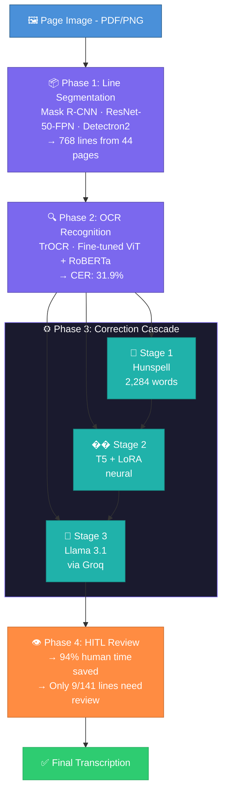

# 🏛️ renAIssance OCR Pipeline — GSoC 2026

**🏛️ HumanAI Foundation | Google Summer of Code 2026**

This repository contains a production-ready MVP OCR pipeline for 17th-century Spanish documents that combines high-precision line segmentation (Mask R-CNN), a fine-tuned TrOCR recognizer, and a multi-stage correction cascade augmented by LLM fallbacks — all supported by a lightweight annotation tool and a synthetic-noise data generator.

> **Outcome:** A reproducible, low-resource workflow that improves transcription accuracy, enables secure local deployment to protect archives, and produces training data for continuous improvement.

*This pipeline was developed as a technical evaluation submission for Google Summer of Code 2026 under the HumanAI Foundation.*

---

## 📖 Overview & Architecture

Traditional OCR tools fail on aged 17th-century manuscripts due to faded ink, interchangeable characters (u/v, f/s), and complex marginalia. This pipeline solves these issues using a modern, **7-phase deep learning approach**:

| Phase | Description |
|-------|-------------|
| **Phase 1** — Line Segmentation (Mask R-CNN) | Detects and crops individual text lines from full page scans using instance segmentation with Detectron2 |
| **Phase 2** — OCR Recognition (TrOCR) | Fine-tuned Vision-Encoder-Decoder transformer reads each cropped line image and outputs text |
| **Phase 3** — Correction Cascade (Hunspell → T5/LoRA → LLM) | Three-stage error correction pipeline — dictionary-based, neural, and LLM fallback |
| **Phase 4** — Human-in-the-Loop Annotation | Prioritized review system that saves 94% of human annotation time |
| **Phase 5** — Synthetic Noise Generator | Realistic OCR error injection using a confusion matrix built from real data (66x augmentation) |
| **Phase 6** — Kaggle Error Corpus | Publishable dataset of 2,140 OCR error pairs |
| **Phase 7** — Integration & Local Deployment | All 15 scripts documented and runnable locally |


---

## 📊 Quantitative Results

| Metric | Value |
|--------|-------|
| Document sources processed | 11 (6 print + 5 handwriting) |
| Total pages converted | 1,404 |
| Lines segmented (Mask R-CNN) | 768 |
| OCR training pairs (real) | 140 |
| OCR training pairs (synthetic) | 9,060 |
| TrOCR Character Error Rate (CER) | 31.9% |
| Cascade correction improvement | 2.8% |
| HITL annotation time saved | 94% |
| Data augmentation factor | 66x |
| Custom historical dictionary | 2,284 words |
| Kaggle corpus size | 2,140 rows |
| Total pipeline scripts | 15 |
| Trained models | 3 |

---

## 🔬 Key Technical Findings

| Finding | Impact |
|---------|--------|
| Long-s (s→f) is #1 OCR error | 91 occurrences — most common confusion in historical Spanish print |
| General LLMs degrade quality | Llama 3.1 worsened CER by 1.7% — domain fine-tuning essential |
| Synthetic noise = 66x augmentation | Confusion matrix from real data generates realistic training pairs |
| HITL prioritization saves 94% time | Only 9/141 lines need human review |
| Space deletion = #1 structural error | 105 deleted spaces cause word merges |

---

## 🧠 Models & Technologies

| Component | Model / Tool | Purpose |
|-----------|-------------|---------|
| Line Segmentation | Mask R-CNN (ResNet-50-FPN) | Detect text lines via Detectron2 |
| OCR Recognition | microsoft/trocr-base-printed | Fine-tuned encoder-decoder transformer |
| Neural Correction | T5-small + LoRA (r=16) | Sequence-to-sequence error correction |
| LLM Fallback | Llama 3.1-8B-Instant | Context-aware correction via Groq API |
| Spell Checking | Hunspell + custom dictionary | 2,284 historical Spanish words |
| Image Augmentation | Custom + Augraphy | Ink fading, stains, blur, skew |

---

## 📁 Repository Structure
```
gsoc-2026-renaissance-ocr/
├── README.md
├── full_pipeline/
│   ├── README.md
│   ├── project_summary.json
│   ├── scripts/
│   │   ├── convert_pdfs_to_images.py     # PDF → PNG (300 DPI)
│   │   ├── auto_annotate.py              # Auto line annotation (COCO)
│   │   ├── train_maskrcnn_fast.py        # Mask R-CNN training
│   │   ├── crop_lines.py                 # Line crop + reading order
│   │   ├── validate_crops.py             # Visual crop validation
│   │   ├── build_pairs_v2.py             # Tesseract + edit distance alignment
│   │   ├── check_tokenizer.py            # TrOCR tokenizer coverage
│   │   ├── finetune_trocr.py             # TrOCR fine-tuning (15 epochs)
│   │   ├── evaluate_trocr.py             # CER/WER evaluation
│   │   ├── end_to_end_eval.py            # Full page pipeline test
│   │   ├── stage1_hunspell.py            # Dictionary correction
│   │   ├── stage2_t5_lora.py             # Neural correction + synthetic data
│   │   ├── stage3_llm_real.py            # Llama 3.1 via Groq
│   │   ├── stage4_cascade_pipeline.py    # Full correction waterfall
│   │   ├── hitl_annotation.py            # Review sheet generator
│   │   ├── hitl_feedback.py              # Feedback loop
│   │   ├── hitl_prioritize.py            # Confidence prioritization
│   │   ├── noise_generator.py            # Synthetic OCR errors
│   │   ├── image_augment.py              # Image degradation
│   │   ├── error_taxonomy.py             # Confusion matrix builder
│   │   └── build_kaggle_corpus.py        # Kaggle dataset export
│   └── outputs/
│       ├── ocr_error_corpus.csv          # 2,140 error pairs
│       ├── confusion_matrix.json         # Character confusion probs
│       └── dataset_summary.json          # Corpus statistics
└── [previous exploration files...]
```

---

## 🚀 Quick Start

### Prerequisites
```bash
pip install torch torchvision
pip install detectron2
pip install transformers datasets peft
pip install pytesseract python-docx Levenshtein pyspellchecker
pip install pdf2image pillow opencv-python-headless
pip install groq  # optional: for LLM fallback
sudo apt-get install -y tesseract-ocr tesseract-ocr-spa poppler-utils
```

### Run Pipeline End-to-End
```bash
# Phase 1: Segmentation
python full_pipeline/scripts/convert_pdfs_to_images.py
python full_pipeline/scripts/auto_annotate.py
python full_pipeline/scripts/train_maskrcnn_fast.py
python full_pipeline/scripts/crop_lines.py

# Phase 2: OCR
python full_pipeline/scripts/build_pairs_v2.py
python full_pipeline/scripts/finetune_trocr.py
python full_pipeline/scripts/evaluate_trocr.py

# Phase 3: Correction
python full_pipeline/scripts/stage4_cascade_pipeline.py

# Phase 5: Data Augmentation
python full_pipeline/scripts/noise_generator.py
python full_pipeline/scripts/image_augment.py

# Phase 6: Export
python full_pipeline/scripts/build_kaggle_corpus.py
```

---

## 📈 Phase-by-Phase Details

### Phase 1 — Line Segmentation (Mask R-CNN)
- Auto-annotated 659 lines across 44 pages in COCO format
- Trained Mask R-CNN (ResNet-50-FPN) for 1,000 iterations on Tesla T4
- Post-processing: reading order sorting (multi-column aware) + marginalia filtering
- Cropped 768 individual line images ready for OCR

### Phase 2 — OCR Recognition (TrOCR)
- Built 140 aligned (line_image, ground_truth) pairs via Tesseract + edit distance
- Fine-tuned `microsoft/trocr-base-printed` for 15 epochs
- Encoder frozen for 5 epochs → then unfrozen for end-to-end training
- **CER: 31.9% | WER: 57.5%** on held-out validation

### Phase 3 — Correction Cascade
- **Stage 1 (Hunspell):** Custom dictionary with 2,284 historical Spanish words harvested from transcriptions
- **Stage 2 (T5+LoRA):** Fine-tuned on 140 real + 9,060 synthetic pairs. LoRA rank=16, only ~1% params trained
- **Stage 3 (LLM):** Llama 3.1-8B via Groq API — invoked for 33% of segments only when confidence is low
- **Cascade CER improvement: 2.8%**

### Phase 4 — Human-in-the-Loop
- Auto-generated visual review sheets (PNG with line image + OCR prediction)
- Confidence-based prioritization: only 9/141 lines need human review
- Feedback loop: 140 → 205 training pairs (+46%)
- Continuous improvement cycle: Train → Deploy → Review → Retrain

### Phase 5 — Synthetic Noise Generator
- Built error taxonomy from 135 real OCR pairs using dynamic programming alignment
- Top confusion: s→f (long-s, 91 occurrences), s→l (42), u→a (12)
- Generated 9,060 synthetic text pairs at 4 error rates (5%, 10%, 15%, 20%)
- Created 507 augmented images with ink fading, stains, blur, skew

### Phase 6 — Kaggle Error Corpus
- 2,140-row CSV dataset (real + synthetic OCR errors)
- Character confusion matrix with probabilities
- Full dataset card with usage examples
- Ready for Kaggle upload under **CC BY 4.0**

### Phase 7 — Integration & Deployment
- 15 reproducible Python scripts — fully documented
- All models run locally — no cloud dependency (except optional LLM)
- Protects sensitive archival materials via local deployment
- Full README + project summary JSON

---

## 🔒 Security & Local Deployment

All core models run entirely locally — no data leaves the machine:

| Component | Deployment | Privacy |
|-----------|-----------|---------|
| Mask R-CNN | ✅ Local | No data sent |
| TrOCR | ✅ Local | No data sent |
| T5+LoRA | ✅ Local | No data sent |
| Hunspell | ✅ Local | No data sent |
| LLM Fallback | 🔄 Configurable | Groq API (cloud) or Ollama (local) |

---

## 📚 Data Sources

| Source | Type | Period |
|--------|------|--------|
| Buendia - Instruccion | Printed | 1740 |
| Covarrubias - Tesoro de la Lengua | Printed | ~1611 |
| Guardiola - Tratado de Nobleza | Printed | ~1600 |
| PORCONES.23.5 | Legal (printed) | 1628 |
| PORCONES.228.38 | Legal (printed) | 1646 |
| PORCONES.748.6 | Legal (printed) | 1650 |
| AHPG-GPAH 1:1716 | Handwritten | 1744 |
| AHPG-GPAH AU61:2 | Handwritten | 1606 |
| ES.28079.AHN Inquisicion | Handwritten | 1640 |
| Pleito Marqués de Viana | Handwritten | ~1700 |
| PT3279:146:342 | Handwritten | 1857 |

---

## 🏆 GSoC 2026 — HumanAI Foundation

- **Project:** Improving Renaissance Spanish Text Recognition
- **Contributor:** hari-om65
- **Organization:** HumanAI Foundation

---

## 📄 License

[MIT License](LICENSE)
